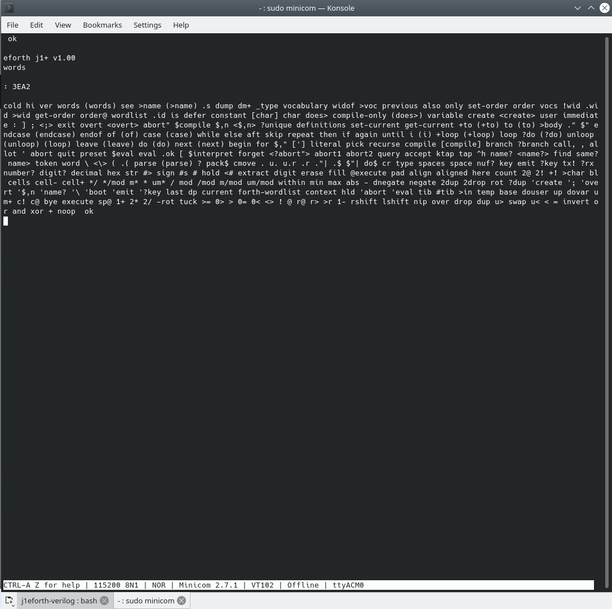

# Verilog-Playground
My Verilog Coding Experimental Area

## j1eforth-verilog for FOMU

Translation of the j1eforth interactive Forth environment for FOMU (https://www.crowdsupply.com/sutajio-kosagi/fomu with documentation at  https://workshop.fomu.im/en/latest/) translated from Silice to Verilog.

The original J1 CPU (https://www.excamera.com/sphinx/fpga-j1.html with a very clear explanatory paper at https://www.excamera.com/files/j1.pdf) along with the j1eforth interactive Forth environment (https://github.com/samawati/j1eforth) was written for an FPGA with access to 16384 x 16bit (256kbit) dual port single cycle block ram, whereas the FOMU has 120kbit of block ram. It does however have 1024kbit of single port ram (65536 x 16bit), which is more than sufficient for j1eforth, but it has 2 cycle latency.

j1eforth for FOMU was originally coded in Silice (https://github.com/sylefeb/Silice) due to my limited (i.e. NO) FPGA programming experience. Silice provides a nice introduction to FPGA programming for those coming from more tradition software coding. Once this design was working, especially the timings to access the single port ram, I translated it back to verilog, as an educational experience for myself.

I've, in my opinion, tidied up the code, to make the variables more explanatory, and to aid my coding.

For communicating via a terminal the tinyfpga_bx_usbserial (https://github.com/stef/nb-fomu-hw) was implemented to provide a 115200 baud UART. A 32 character input and output buffer was added.

## Using j1eforth-verilog on the FOMU

Download the source code from this repository. Ensure that you have the required toolchain installed. Compile (on Linux) with `./fomu_hacker_USB_SPRAM.sh` within the source directory.

Or download the precompiled `build.dfu` file from this repository.

Upload the compiled, or downloaded bitstream to your FOMU with `dfu-util -D build.dfu` and connect via your chosen terminal, for minicom `minicom -D /dev/ttyACM0` (ACM0 may need replacing with an appropriate number on your machine).

## Resources on the FOMU

Resource usage is considerably reduced using directly coded verilog compared to Silice, with @sylefeb is investigating and looking for improvements to Silice:

```
Info: Device utilisation:
Info:            ICESTORM_LC:  2420/ 5280    45%
Info:           ICESTORM_RAM:    19/   30    63%
Info:                  SB_IO:    12/   96    12%
Info:                  SB_GB:     8/    8   100%
Info:           ICESTORM_PLL:     0/    1     0%
Info:            SB_WARMBOOT:     0/    1     0%
Info:           ICESTORM_DSP:     0/    8     0%
Info:         ICESTORM_HFOSC:     0/    1     0%
Info:         ICESTORM_LFOSC:     0/    1     0%
Info:                 SB_I2C:     0/    2     0%
Info:                 SB_SPI:     0/    2     0%
Info:                 IO_I3C:     0/    2     0%
Info:            SB_LEDDA_IP:     0/    1     0%
Info:            SB_RGBA_DRV:     1/    1   100%
Info:         ICESTORM_SPRAM:     4/    4   100%
```

The original J1 CPU has this instruction encoding:

```
+---------------------------------------------------------------+
| F | E | D | C | B | A | 9 | 8 | 7 | 6 | 5 | 4 | 3 | 2 | 1 | 0 |
+---------------------------------------------------------------+
| 1 |                    LITERAL VALUE                          |
+---------------------------------------------------------------+
| 0 | 0 | 0 |            BRANCH TARGET ADDRESS                  |
+---------------------------------------------------------------+
| 0 | 0 | 1 |            CONDITIONAL BRANCH TARGET ADDRESS      |
+---------------------------------------------------------------+
| 0 | 1 | 0 |            CALL TARGET ADDRESS                    |
+---------------------------------------------------------------+
| 0 | 1 | 1 |R2P| ALU OPERATION |T2N|T2R|N2A|   | RSTACK| DSTACK|
+---------------------------------------------------------------+
| F | E | D | C | B | A | 9 | 8 | 7 | 6 | 5 | 4 | 3 | 2 | 1 | 0 |
+---------------------------------------------------------------+

T   : Top of data stack
N   : Next on data stack
PC  : Program Counter
 
LITERAL VALUES : push a value onto the data stack
CONDITIONAL    : BRANCHS pop and test the T
CALLS          : PC+1 onto the return stack

T2N : Move T to N
T2R : Move T to top of return stack
N2A : STORE T to memory location addressed by N
R2P : Move top of return stack to PC

RSTACK and DSTACK are signed values (twos compliment) that are
the stack delta (the amount to increment or decrement the stack
by for their respective stacks: return and data)
```

The J1+ CPU adds up to 16 new alu operations, by assigning new opcodes to an ALU instruction bit 4.

Binary ALU Operation Code | J1 CPU | J1+ CPU | J1 CPU Forth Word (notes) | J1+ CPU Forth Word | J1+ Implemented in j1eforth
---- | ---- | ---- | ---- | ---- | ----
0000 | T | T==0 | | 0= | X
0001 | N | T<>0 | | 0<> | X
0010 | T+N | N<>T | + | <> | X
0011 | T&N | T+1 | and | 1+ | X
0100 | T&#124;N | | or | | 
0101 | T^N | | xor | | 
0110 | ~T | | invert | | 
0111 | N==T | | = | | 
1000 | N<T | | < (signed) | | 
1001 | N>>T | | rshift | | 
1010 | T-1 | | 1- | | 
1011 |  rt | | (push top of return stack to data stack) | | 
1100 | [T] | | @ (read from memory) | | 
1101 | N<<T | | lshift | | 
1110 | dsp | | (depth of stacks) | | 
1111 | NU<T | | < (unsigned) | | 

### Memory Map

Hexadecimal Address | Usage
---- | ----
0000 - 3fff | Program code and data
4000 - 7fff | RAM (written to with `value addr !`, read by `addr @`
f000 | UART input/output (best to leave to j1eforth to operate via IN/OUT buffers)
f001 | UART Status (bit 1 = TX buffer full, bit 0 = RX character available, best to leave to h1eforth to operate via IN/OUT buffers)
f002 | RGB LED input/output
f003 | BUTTONS input

### Forth Words to try
* `cold` reset
* `words` list known Forth words
* `cr` output a carriage return
* `2a emit` output a * (character 2a (hex) 42 (decimal)
* `decimal` use decimal notation
* `hex` use hexadecimal notation


